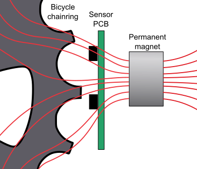
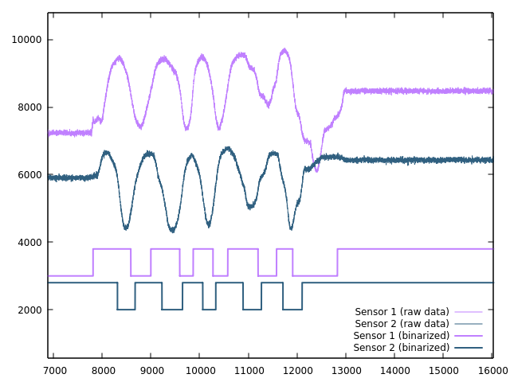
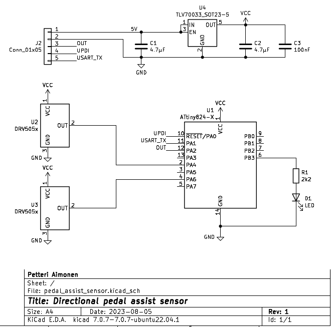
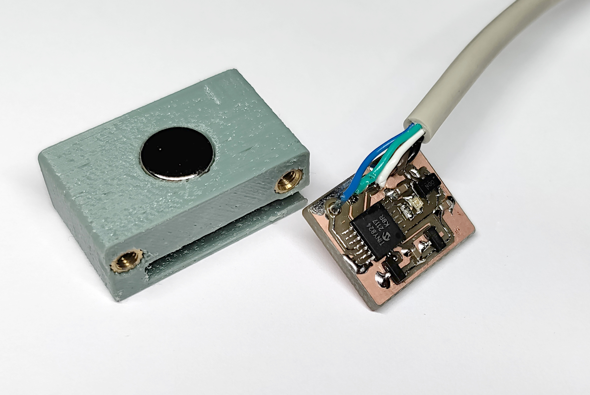
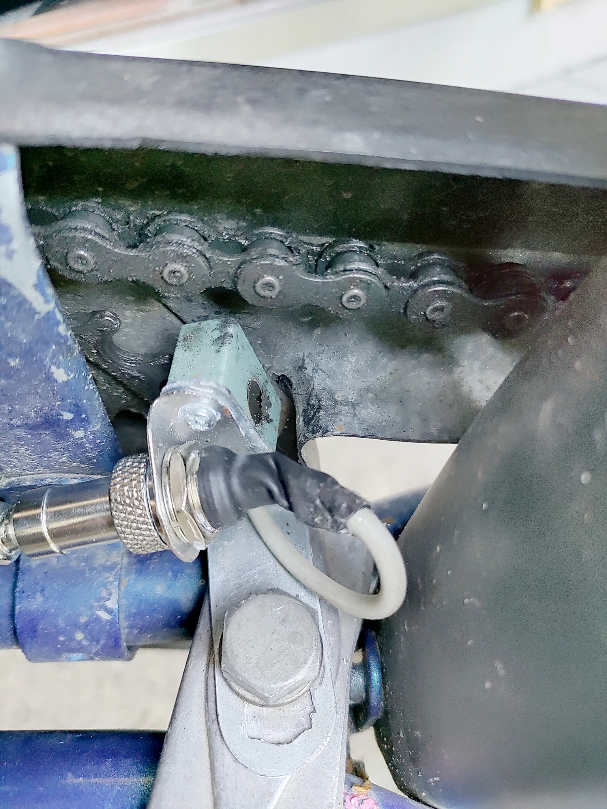

Directional pedal assist sensor
===============================

This repository contains a simple design for pedal assist sensor that does
not require mounting a separate magnet disc to the pedal axle.

Instead, the motion of the chainring is detected using analog hall sensors
and a magnet positioned nearby.

## Goal

Electric assist bicycles use a pedal sensor to control motor activation.
When pedals spin, motor is active - when pedals stop, motor stops.
Actual assist level is controlled separately, by e.g. a handle, torque sensor or accelerometer.

Most common pedal sensor type uses a separate magnet disc, which can be annoying to mount.
The number of magnets on the disc also limit the sensitivity, requiring longer rotation of the cranks before the motor activates.

For bicycles with pedal-activated brakes, it is also important to sense the movement direction.

## Theory of operation

Any ferromagnetic object will distort the magnetic field lines in its vicinity.
Analog [Hall effect](https://en.wikipedia.org/wiki/Hall_effect) sensors are used to detect the passing of the teeth by sensing the variations in the field.

The measured values are processed to determine middle analog level and then binarized.
After that it can be treated as a [quadrature encoder signal](https://en.wikipedia.org/wiki/Incremental_encoder#Quadrature_outputs).

This is used to count the number of passing teeth and determine the direction.
After a few teeth in forward direction have passed, signal is sent to motor controller to activate it.
If teeth move in the reverse direction or no pulses are detected within a timeout, the output signal goes back low.

## Circuit and PCB

The circuit is based on ATtiny824 microcontroller and [DRV5053](https://www.ti.com/lit/ds/symlink/drv5053.pdf?ts=1696181784911&ref_url=https%253A%252F%252Fwww.google.com%252F) analog Hall sensors. The built-in ADC is used to read the analog signals.
To improve signal resolution, the DAC is used as a reference voltage and PGA provides 4x gain.

## Software

Software is built using platformio.

To compile, run `pio run`. You can use a USB serial adapter for programming with [pyupdi](https://github.com/mraardvark/pyupdi). Run `pio run -t upload` to program the microcontroller.

There are unit tests that can you can run on PC with `pio test -e native`.

The `main.c` file contains a few settings that can be customized.
By enabling `ENABLE_UART` and `DATA_DUMP` the raw sensor data is written out over 115200 bps UART connection in binary format.
This can then decoded and run through signal processing using `pio run -e native -t exec < testdata.bin`, which will dump out a CSV file.

## Mounting

Positioning is important for reliable operation. For me, it has worked best to have the hall sensors in line with the chainring teeth, and as close as possible.

